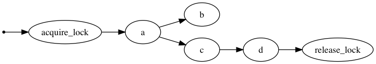

# Bonobo playground files

## Bonobo parallel pipelines with lock

[bonobo-pipelines-lock.py](bonobo-pipelines-lock.py) Experiment with Bonobo pipeline using Lock. Node 'b' takes input from Node 'a' but is NOT allowed to proceed until Node 'd' has finished.

